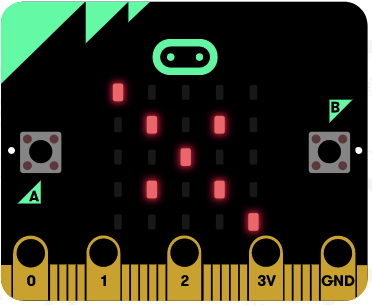

## Design your image

1. Connect the micro:bit to your computer using the USB cable

1. Open the Mu editor

1. Add the following code to import the micro:bit libraries you'll need:

    ```python
    import radio
    import random
    from microbit import display, Image, button_a, sleep
    ```

1. Create an image to be shown on LEDs:

    ```python
    pic = Image(
        "90009:"
        "07070:"
        "00500:"
        "07070:"
        "90009"
    )
    display.show(pic, delay=100, wait=False)
    ```

1. Click the **Flash** button at the top of the Mu window. Your image should appear on the LEDs.

    

1. Can you edit your code to display a different image?
