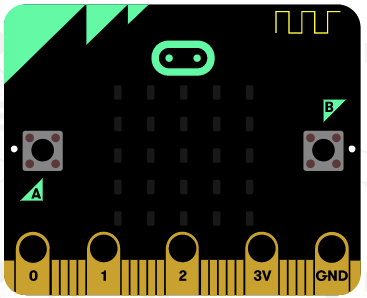
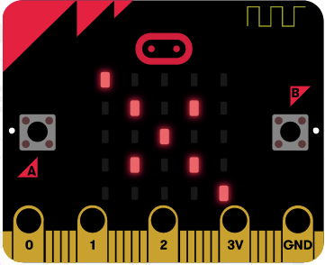

### Set up the radio

1. Add some code to turn on the radio.

    ```python
    radio.on()
    ```

1. Now add some code that will trigger when Button A is pressed and send a radio message. Enter some text to send as the message ("*now*" is used as an example here).

    ```python
    while True:
        if button_a.was_pressed():
            radio.send('now')
    ```

1.  Move your `display_show` line so that it is only triggered when the same radio message is received.

    ```python
    message = radio.receive()
    if message == 'now':
        display.show(pic, delay=100, wait=False)
    ```

1. Find someone else who is at the same point and test your code? Does pressing Button A cause their image to appear on their micro:bit?

1. Can you add  `sleep` and  `display.clear()` code so that the image disappears after a short delay?




